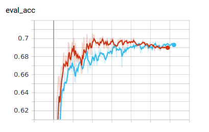
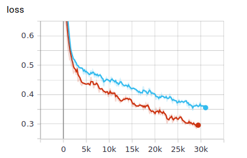

## Fact verification on news
The goal of this project is to create an IA to check the facts of news sentence based on their evidences.

The evidence text either _supports_ or _refutes_ the claim.

## Authors

_Tales Marra_ and _Max Sobroza_.

### Requirements

In order to be able to execute the following steps, you will need to create a Python 3.7 Environement.
This can be done by:

```bash
pip install requirements.txt
```

### Directory Structure

```
fact_verification_news_busterai
│   README.md 
│   requirements.txt
|   Merge all datasets.ipynb   <- notebook to merge data 
├── fever_data_prep
│   │   FEVER_data_preparation_and_analysis.ipynb  
│   ├── preprocessed_data      <- preprocessed data
│   |   │   fever_train.pkl
│   |   │   fever_dev.pkl
│   |   │   fever_test.pkl
|   ├── data        <- raw data 
│       │   license.html
|       ├── fever_data
|       |   dev.jsonl
|       |   test.jsonl
|       |   train.jsonl
├── hoaxes_data_prep
│   │   hoaxes_data_preparation_and_analysis.ipynb  
│   ├── preprocessed_data      <- preprocessed data
│   |   │   hoaxes.pkl
├── liar_plus_dataset_prep
│   │   LiarPlus_data_preparation_and_analysis.ipynb
│   ├── preprocessed_data      <- preprocessed data
│   |   │   liar_plus_test.pkl
│   |   │   liar_plus_train.pkl
│   |   │   liar_plus_val.pkl
|   ├── data                   <- raw data 
|   |   test2.tsv
|   |   train2.tsv
|   |   val2.tsv
|   ├── .ipynb_checkpoints     <- checkpoints 
|   |   LiarPlus Analysis and Preparation checkpoint.ipynb
|   
├── runs                       <- cache memory from executions
|   │   
|   ├──  	Nov14_01-58-22_StationRTX
│   |   │   events.out.tfevents.1573693102.StationRTX
|   ├──   Nov14_02-03-01_StationRTX
│       │   events.out.tfevents.1573693381.StationRTX
|   ├──   Nov14_02-16-03_StationRTX
│   |   │   events.out.tfevents.1573694163.StationRTX
|   ├──   Nov14_02-21-12_StationRTX
│   |   │   events.out.tfevents.1573694472.StationRTX
|   ├──   Nov14_02-32-08_StationRTX
│   |   │   events.out.tfevents.1573695128.StationRTX
|   ├──   Nov14_02-43-23_StationRTX
│   |   │   events.out.tfevents.1573695803.StationRTX
|   ├──   Nov15_00-48-59_StationRTX
│   |   │   events.out.tfevents.1573775339.StationRTX
|
|   1.png                    <- accuracy
|   2.png                    <- loss
|   run_glue.py              <- main file 
|   utils_glue_modified.py   <- useful functions to the model
|   all_train_df.pkl         <- train data 


```


### 1 - Data Collection and Preparation

In order to perform this task, we are going to use mainly two datasets: FEVER and LIAR_PLUS. As the labels of those
datasets were not the same, we had to do the convertion of the labels from one dataset to the other, which is
explained in details in each data_preprocessing notebook.

Each folder named in which the name includes data_prep has a notebook for the data preparation step, if you want to
perform it by yourself. If not, each folder also contains a folder named preprocessed data, where preprocessed data can
be found.

In order to execute the merging of all dataset, use the notebook _Merge all datasets.ipynb_. 

### 2 - Model Training and Evaluation

In order to train the model in order to reproduce the results shown, use the following line of command:

```bash
python run_glue.py --data_dir dataset --model_type xlm --model_name_or_path xlm-clm-enfr-1024 --task_name buster --output_dir output --do_train --evaluate_during_training --do_eval 
```
If you do not want to perform evaluation during training, remove  the --evaluate_during_training parameter.

### 3 - Results 

In order to compare our results with current SOTA models, we have performed the evaluation on the test set of
the FEVER dataset.

|     Model     |    Accuracy(%)   | 
| ------------- | ------------- |
|    XLM (ours) |    70.02        |
|     BERT (Large) & BERT (Pointwise + HNM)     |     71.86     |
| DREAM (Zhong et al., 2019)                    |     76.85     |





### References

[1] Wolf, T., et al. "Huggingface’s transformers: State-of-the-art natural language processing." ArXiv, abs (1910).


[2] Soleimani, Amir, Christof Monz, and Marcel Worring. "BERT for Evidence Retrieval and Claim Verification." arXiv preprint arXiv:1910.02655 (2019).


